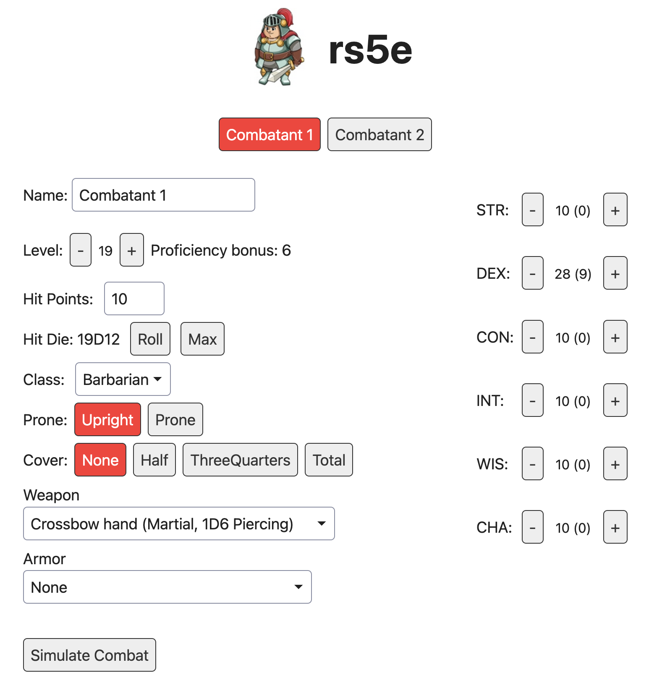

# rs5e

This project is an attempt to simulate physical combat using the DnD 5e rules from the SRD

It includes a client web interface to build two characters and smash them into each other.



## Run Server

```
cargo run
```

Or in release mode:

```

cargo run --release -- 127.0.0.1:8080

```

Or with Optional IP & Port (uses 127.0.0.1:8080 if not provided)

```

cargo run -- 127.0.0.1:8080

```

## Run Client

Before each instruction below you should initially run:

```

cd client
npm install

```

The client doesn't really work without the server, initial the initial
data that it shows is driven by the server.  You can technically run it
in dev mode and see the useless "loading" message with:

```

npm run dev

```

or in release mode to output to the `dist` directory:

```

npm run build

```

## Run both client and server together (recommended)

The best way to test is to use the `serve.sh` script which will run the
server and client at the same time accessible on `localhost:8080`

From the project root just run:

```

./serve.sh

```

## Run with Docker

This project comes with a `Dockerfile` so you can easily deploy it
wherever you like (both client and server)

For local builds just run:

```

docker build -t rs5e-app .

docker run --name rs5e-app -p 8080:8080 rs5e-app

```

Then access the game at:

[http://localhost:8080]()

Or deploy wherever you want.

### Deployment

This project can be deployed via Docker on [https://fly.io/](https://fly.io/)

Install the fly CLI and then:

```

fly auth login

fly launch (if first time, see below for fly deploy if not)

```

Fly will launch the app and create a `fly.toml` in the root directory with project config options.

Subsequent re-launches using that configuration to overwrite can be made with:

```

fly deploy

```

## Credits

The project obviously wouldn't be possible without the folks that put together the SRD

[DnD 5e Systems Reference Document](https://dnd.wizards.com/resources/systems-reference-document)

This project leverages data from the DnD 5e database:

[5e-database](https://github.com/5e-bits/5e-database)

This project uses Simple CSS

[Simple CSS](https://simplecss.org/)
